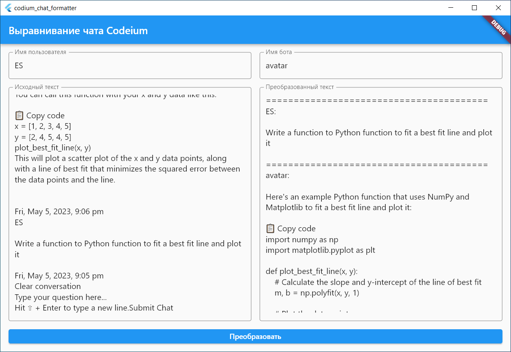

# codium_chat_formatter

A formatter for codeium chat.

## Getting Started

1. Run the formatter.
2. Open the Codeium chat.
3. Press Ctrl+A and Ctrl+C
4. Paste the chat into the left panel of the formatter.
5. Specify the user name as it displayed in the chat.
6. Press the process button

